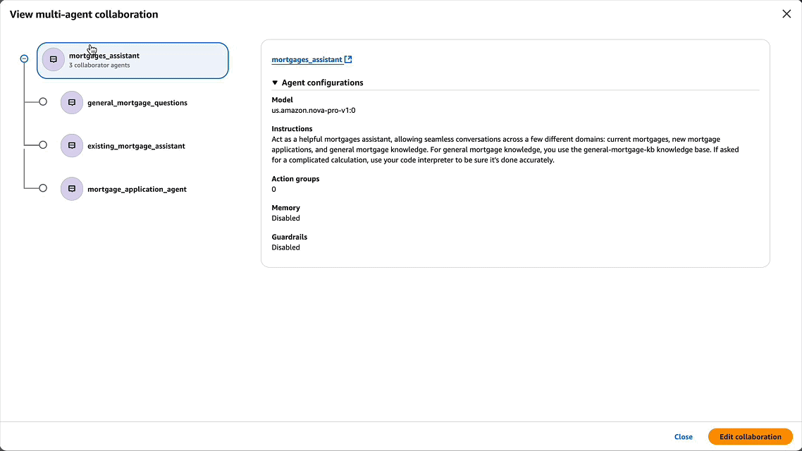

<h2 align="center">Amazon Bedrock Agent 动手练习工作坊</h2>
<p align="center">
  :wave: :wave: 欢迎来到 Amazon Bedrock Agent 中国区工作坊 :wave: :wave:
</p>

## 关于本仓库

本仓库是 [Amazon Bedrock Agent Samples](https://github.com/awslabs/amazon-bedrock-agent-samples) 的分支的版本，为亚马逊云科技中国区的用户提供动手练习工作坊。通过本工作坊，您可以使用 Amazon Nova Pro 模型来部署运行 mortgage_assistant（按揭贷款多智能体应用），体验 Amazon Bedrock Multi Agent Collaboration（多代理协作）的强大功能和优势。

## 工作坊指南

完整操作指南：[基于Amazon Bedrock 构建按揭贷款多智能体应用](https://catalog.us-east-1.prod.workshops.aws/workshops/d674f40f-d636-4654-9322-04dafc7cc63e/zh-CN/4-lab-3)



*上图展示了按揭贷款多智能体应用的组织结构*

## 自助实验环境部署

如果您是在自己的亚马逊云科技账户中完成这个动手练习，可以按照以下步骤操作：

1. 使用 `workshop_cfn_vscodeserver_with_AgentCode.yaml` CloudFormation 模板部署实验资源。
2. 该模板会自动启动一台 t3.large 规格的 Amazon Linux EC2 实例，自动安装 VSCode Server 并克隆所需的代码仓库。
3. 按照[动手操作指南](https://catalog.us-east-1.prod.workshops.aws/workshops/d674f40f-d636-4654-9322-04dafc7cc63e/zh-CN/4-lab-3)完成多智能体应用部署，并进行交互测试。
4. 本实验还提供一个彩蛋，免费注册 [Amazon Builder ID](https://docs.aws.amazon.com/zh_cn/signin/latest/userguide/create-aws_builder_id.html)，安装 [Amazon Q Developer CLI 开发者助手工具](https://docs.aws.amazon.com/amazonq/latest/qdeveloper-ug/command-line.html)。体验 Q Chat 智能辅助工具提升开发效率。

## 实验清理

**重要提示**：实验完成后，请按照以下步骤清理资源，避免不必要的费用产生：

1. 首先执行清理脚本，这个脚本将会删除所有 Bedrock Agent 相关资源：
   ```bash
   cd /home/ec2-user/amazon-bedrock-agent-workshop-for-gcr
   chmod +x workshop_cleanup.sh
   ./workshop_cleanup.sh
   ```
   -- 清理过程会显示在终端中，您可以直观地看到资源被删除的过程
   -- 清理日志也会保存在 `/var/log/workshop-cleanup.log`

2. 然后停止 EC2 实例
   -- 作为备份措施，系统在停止时也会再次自动执行清理脚本，确保所有资源被正确删除

3. 确认清理完成后，可以删除 CloudFormation 堆栈

## 主要功能

通过本工作坊，您将能够：
- 了解Amazon Bedrock Agents的基本概念和工作原理
- 使用Amazon Nova Pro模型构建智能代理
- 体验多代理协作如何解决复杂问题
- 实际操作部署mortgage_assistant（按揭助手）应用
- 学习Amazon Bedrock的最佳实践
- 体验Amazon Q Developer命令行开发助手，提升开发效率
  
## 系统要求

- 有效的AWS账户
- 对 Amazon Bedrock服务的访问权限
- 基本的 AWS CloudFormation使 用经验

---

[Amazon Bedrock Agent Samples (英文版)](README_EN.md)
