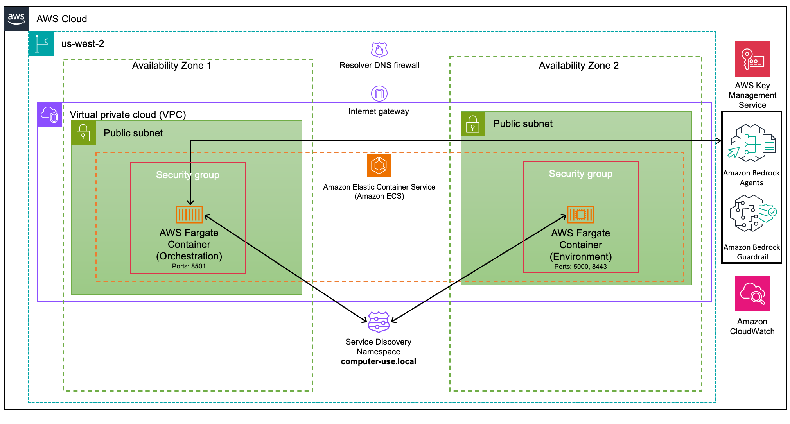
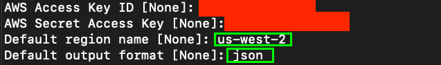
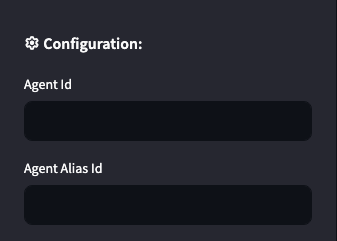
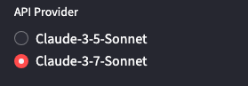

# Computer use using Amazon Bedrock Agents

> [!CAUTION]
> Computer use feature is made available to you as a ‘Beta Service’ as defined in the AWS Service Terms. It is subject to your Agreement with AWS and the AWS Service Terms, and the applicable model EULA. Computer Use poses unique risks that are distinct from standard API features or chat interfaces. These risks are heightened when using the Computer Use to interact with the Internet. To minimize risks, consider taking precautions such as:
> Operate computer use functionality in a dedicated Virtual Machine or container with minimal privileges to prevent direct system attacks or accidents.
> To prevent information theft, avoid giving the Computer Use API access to sensitive accounts or data.
> Limiting the computer use API’s internet access to required domains to reduce exposure to malicious content.
> To ensure proper oversight, keep a human in the loop for sensitive tasks (such as making decisions that could have meaningful real-world consequences) and for anything requiring affirmative consent (such as accepting cookies, executing financial transactions, or agreeing to terms of service).
> Any content that you enable Claude to see or access can potentially override instructions or cause Claude to make mistakes or perform unintended actions. Taking proper precautions, such as isolating Claude from sensitive surfaces, is essential — including to avoid risks related to prompt injection. Before enabling or requesting permissions necessary to enable computer use features in your own products, please inform end users of any relevant risks, and obtain their consent as appropriate.


This project contains the [AWS Cloud Development Kit](https://aws.amazon.com/cdk/) (CDK) infrastructure code for deploying the computer use agent using Amazon Bedrock Agent in the us-west-2 (Oregon) region.




<details>
  <summary>
    <h4>Infrastructure Components<h4>
  </summary>
  
  - **Amazon VPC**: Configured with public and private subnets across 2 AZs in us-west-2. This configuration also has VPC flow logs enabled.
  - **Amazon ECR Repository**: Single repository for both environment and orchestration images.
  - **Amazon ECS**: ECS cluster for running containers.
  - **Amazon Task Definition**: Task definations of environment and orchestration containers with appropriate port mappings.
  - **Amazon Security Groups**: 
    - Environment container: Accepts traffic only from orchestration container
    - Orchestration container: Accepts `public` traffic on port 8501
  - **AWS IAM Roles**: Task execution role with minimal permissions
  - **Amazon CloudWatch Logs**: Configured for container logging
  - **AWS KMS**: Encryption key for secure storage

</details>

<details>
<summary>
<h4>Container Ports<h4>
</summary>

- **Environment Container**:
  - 8443: [Amazon DCV](https://aws.amazon.com/hpc/dcv/)
  - 5000: [Quart](https://github.com/pallets/quart) RESTful API
- **Orchestration Container**:
  - 8501: [Streamlit](https://streamlit.io/) interface

</details>

<details>
<summary>
<h4>Repository Structure<h4>
</summary>

```bash
├── src/amazon_bedrock_agent_app/
├── src/sandbox_environment/
├── scripts/
│   ├── create_amazon_bedrock_agent.py
│   ├── delete_amazon_bedrock_agent.py
|   └── ....
├── app.py
├── computer_use_aws_stack.py
└── ....
```
</details>

## Prerequisites

1. AWS Command Line Interface (CLI), follow instructions [here](https://docs.aws.amazon.com/cli/latest/userguide/getting-started-install.html). Make sure to setup credentials, follow instructions [here](https://docs.aws.amazon.com/cli/latest/userguide/getting-started-quickstart.html).

2. Require [Python 3.11](https://www.python.org/downloads/) or later.

3. Require [Node.js](https://nodejs.org/en/download/) 14.15.0 or later.

4. AWS CDK CLI, follow instructions [here](https://docs.aws.amazon.com/cdk/v2/guide/getting_started.html).

5. Enable [model access](https://docs.aws.amazon.com/bedrock/latest/userguide/model-access.html) for Anthropic’s Claude Sonnet 3.5 V2 and for Anthropic’s Claude Sonnet 3.7 V1.

6. [Boto3](https://boto3.amazonaws.com/v1/documentation/api/latest/index.html) version >= 1.37.10.


## Quick Start

1. Clone the repository:

    ```bash
    git clone https://github.com/awslabs/amazon-bedrock-agent-samples/
    cd amazon-bedrock-agent-samples/examples/agents/computer_use
    chmod +x scripts/get_urls.sh
    ```

2. Configure AWS CLI for us-west-2 (if not already configured):

> [!IMPORTANT]
> 1. You can skip this step if you already have a profile created. Make sure to use the correct profile name in subsequent commands.
> 2. Make sure to select us-west-2 region.

```bash
make configure PROFILE_NAME=computeruse
```



3. Setup Environment and bootstrap AWS Account

    ```bash
    make setup PROFILE_NAME=computeruse
    ```

4. Activate created virtual environment

    ```bash
    source .venv/bin/activate
    ```

5. Deploy the solution in **Fail-Secure Mode** (Default). This is the recommended setting for the sandbox environment.

> [!IMPORTANT]
> In **Fail-Secure Mode** if no IP address is provided, the security groups will default to a highly restrictive setting (255.255.255.255/32) that effectively blocks all access.

> [!IMPORTANT]
> Make sure you review all the resources created by the project before deploying.

> [!IMPORTANT]
> Make sure only run one of the following commands.

    ```bash
    # Deploy with your current IP (Fail-Secure)
    make deploy-infrastructure PROFILE_NAME=computeruse

    # Deploy with manual IP (Fail-Secure)
    make deploy IP=203.0.113.1 PROFILE_NAME=computeruse
    # This will automatically be converted to 203.0.113.1/32

    # Deploy with IP address range (Fail-Secure)
    make deploy IP=203.0.113.0/24 PROFILE_NAME=computeruse
    # Allows 203.0.113.0 through 203.0.113.255
    ```

    > [!NOTE]
    > This stack takes **~10-15 minutes** to deploy. After the deployment **it may take a few additional minutes** for the Environment/Virtual Machine to come online.

6. After the deploy has completed, you can get the URLs of the services:

    ```bash
    make get-urls PROFILE_NAME=computeruse
    ```

7. Create Amazon Bedrock Agent (w/ Computer, Text Editor and Bash Action Groups) and Amazon Bedrock Guardrail

> [!IMPORTANT]
> Make sure to enable [model access](https://docs.aws.amazon.com/bedrock/latest/userguide/model-access-modify.html) before creating Amazon Bedrock Agent.

> [!IMPORTANT]
> Make sure computer use is supported by the provided model and this project.

    ```bash
    make bedrock PROFILE_NAME=computeruse MODEL_ID=us.anthropic.claude-3-7-sonnet-20250219-v1:0 # defaults to us.anthropic.claude-3-7-sonnet-20250219-v1:0
    ```

8. List Amazon Bedrock Agent Id and Alias Id - store these values for later use.

    ```bash
    make list-agent PROFILE_NAME=computeruse
    ```

## Usage

Navigate to the links provided in the output of the `make get-urls` script to access the services, the Orchestration Service URL and Environment Service URL.

[Amazon DCV](https://aws.amazon.com/hpc/dcv/) is used to connect to the environment container for remote desktop access, for activities such as resetting the state of the environment, or elliciting the state of the environment prior to a new task.

> [!IMPORTANT]
> Login to the sandbox environemnt using Amazon DCV, with username `computeruse` and password `admin`.

The [Streamlit](https://streamlit.io/) interface ([streamlit.py](./src/amazon_bedrock_agent_app/app/streamlit.py)) is used to configure the Amazon Bedrock Agent Id and Aliast Id. Then ultimately instruct the Amazon Bedrock Agent via a chat interface to perform tasks.

[Quart](https://github.com/pallets/quart) is used to write a RESTful JSON APIs and is responsible for tool execution. You can run the [app.py](./src/sandbox_environment/computer_use_demo/app.py) as follows:

```bash
quart run
```

```python
import aiohttp

URL = "http://127.0.0.1:5000/execute" # local host

async with aiohttp.ClientSession() as session:
  payload = {
      "tool": "computer",
      "input": {"action": "screenshot"},
  }
  async with session.post(
      URL, json=payload
  ) as api_response:
      api_result = await api_response.json()
```

## Steamlit GUI and DCV Access

After navigating to the Orchestration Service URL (Streamlit interface), you'll need to provide the Agent Id and Agent Alias Id.



Select the foundational model that you used to create Amazon Bedrock Agent. Each foundational model has its own set of tool implementation. 



<details>
  <summary>
    <h4>DNS Firewall Configuration<h4>
  </summary>

  The stack includes a Route 53 Resolver DNS Firewall that controls domain access. By default, it operates on an allowlist basis - only explicitly allowed domains can be accessed while all others are blocked.

  ### Default Allowed Domains

  The firewall allows access to:
  - AWS services (*.amazonaws.com, *.aws.dev, etc.)
  - Amazon domains (amazon.com, a2z.com)
  - Anthropic domains (anthropic.com, claude.ai)
  - GitHub domains (github.com, *.githubassets.com)
  - Google domains (google.com, *.googleapis.com)
  - Python package repositories (pypi.org, pythonhosted.org)
  - Internal service discovery domains (*.computer-use.local)

  ### Updating Allowed Domains

  To modify the allowed domains:

  1. Edit the `cfn_firewall_domain_list` in `computer_use_aws_stack.py`
  2. Add or remove domains using the following format:

    ```python
    domains=[
        "example.com",      # Allow exact domain
        "*.example.com",    # Allow all subdomains
    ]
    ```

  3. Redeploy the stack:

    ```bash
    cdk deploy
    ```

  ### Managing DNS Firewall Rules

  View current rules:

  ```bash
  aws route53resolver get-firewall-rule-group --firewall-rule-group-id <ID>
  ```

  Get the rule group ID from stack outputs:

  ```bash
  aws cloudformation describe-stacks --stack-name ComputerUseAwsStack --query 'Stacks[0].Outputs[?OutputKey==`DnsFirewallRuleGroupId`].OutputValue' --output text
  ```

</details>

## Cleanup

```bash
make clean-bedrock PROFILE_NAME=computeruse
make destroy-infrastructure PROFILE_NAME=computeruse
```

## License

This project is licensed under the Apache-2.0 License.

> [!IMPORTANT]
> Examples in this repository are for demonstration purposes. 
> Ensure proper security and testing when deploying to production environments.
