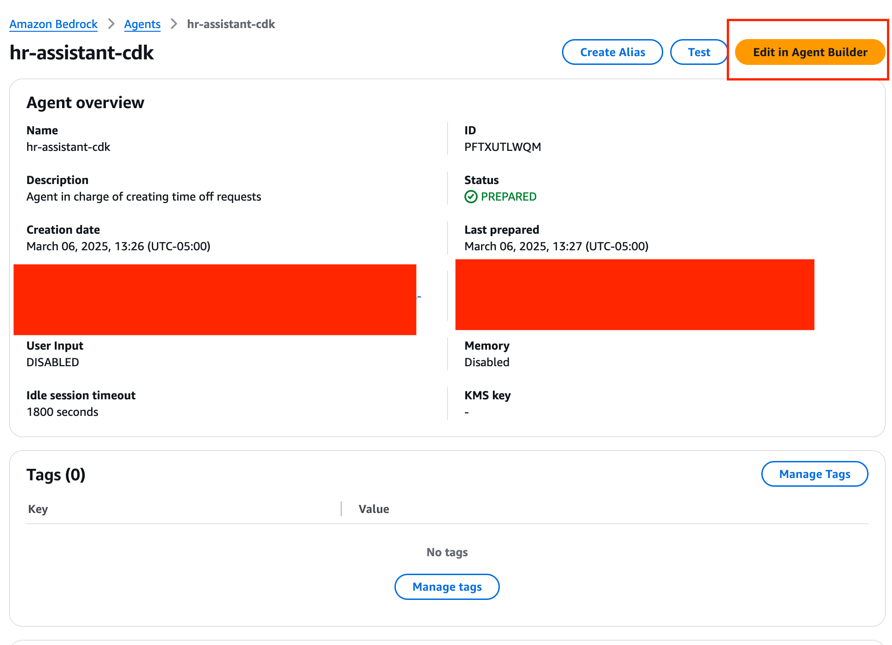
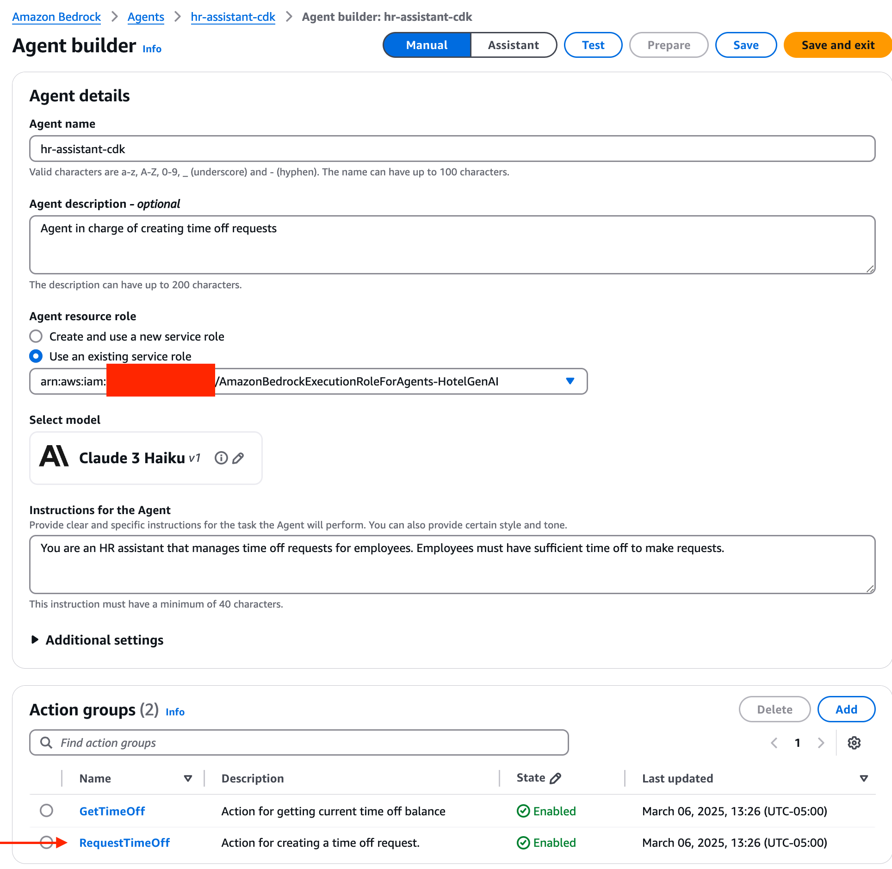
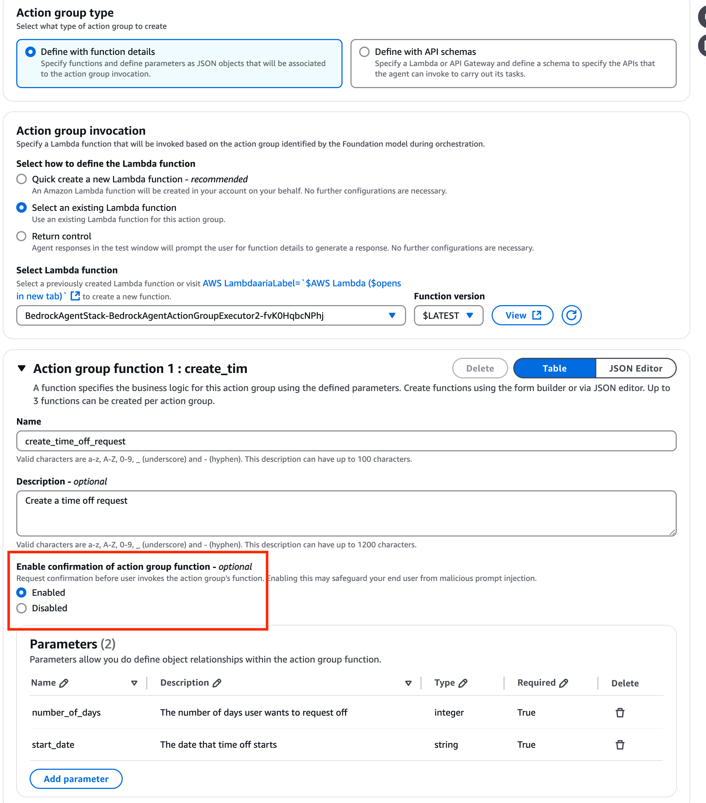
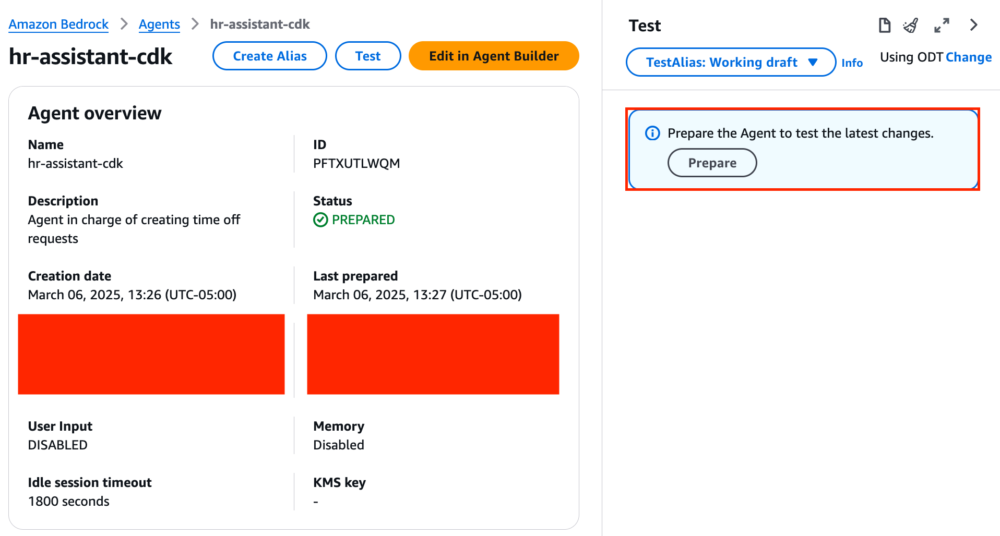
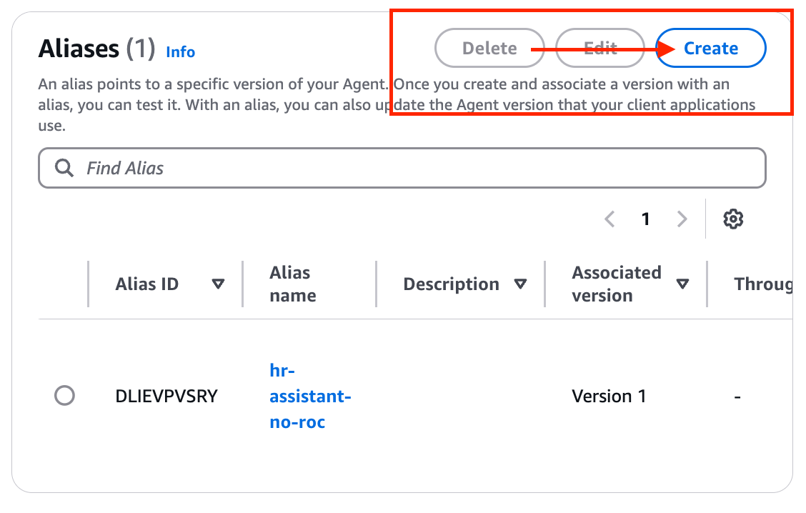
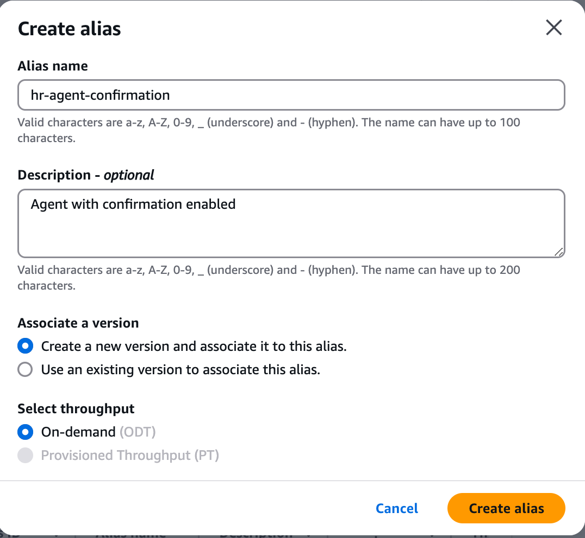
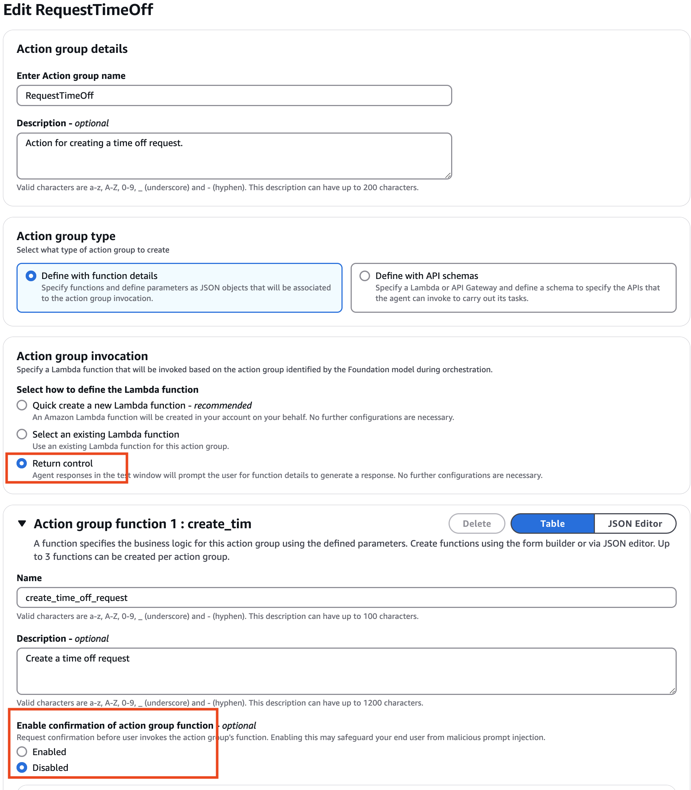
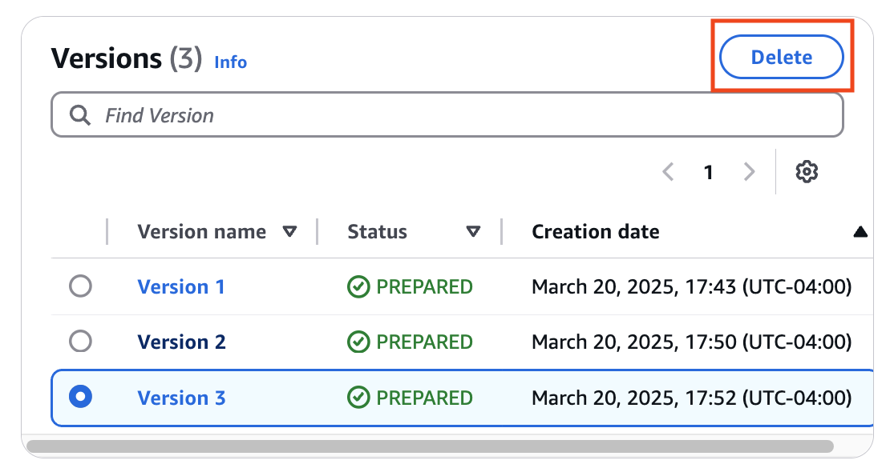
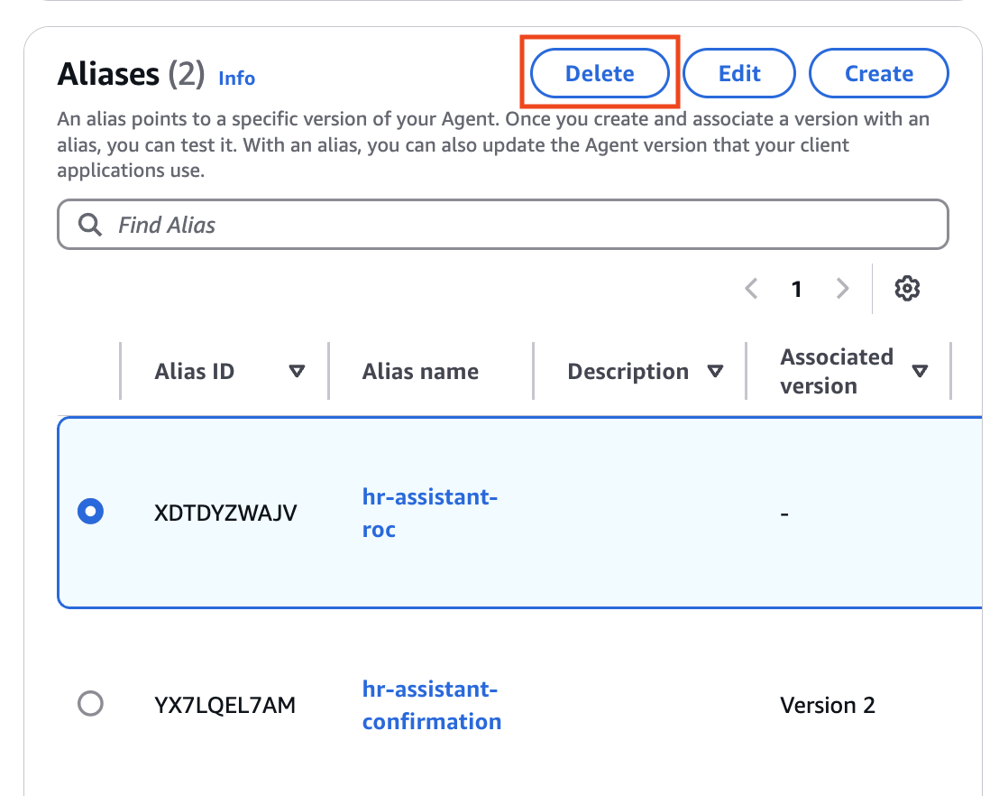
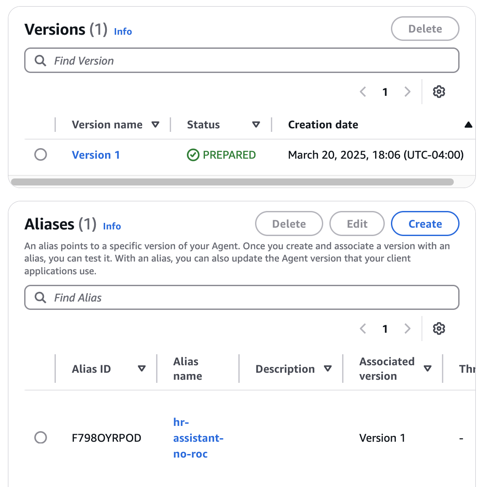

# cdk

## Prerequisites

Please refer to the [main project prerequisites](../README.md) for initial setup requirements.

Additionally, ensure you have:
- AWS CLI installed and configured with appropriate credentials
- AWS region set to `us-west-2` (required for access to latest models like Claude 3.5 Haiku)

To verify your AWS CLI setup is working correctly, run:
```bash
aws s3 ls
2025-01-15 10:30:25 my-bucket-name
2025-02-20 15:45:12 another-bucket-name
2025-03-10 09:15:33 deployment-artifacts
```
If you see your S3 buckets listed, your AWS CLI is properly to execute commands on your account.

## Deployment

### Setting up Virtual Environment

In order to use the cdk, you must first set up a virtual environment and install dependencies. This will install the aws-cdk in the virtual environment.
```
git clone https://github.com/awslabs/amazon-bedrock-agent-samples

cd amazon-bedrock-agent-samples/examples/agents/human_in_the_loop/cdk

python3 -m venv .venv

source .venv/bin/activate

pip3 install -r requirements.txt
```

### Confirm region is us-west-2
Ensure infrastructure is being deployed to `us-west-2` and bootstrap the `cdk`
```
export AWS_DEFAULT_REGION=us-west-2

cdk bootstrap
```

### Deploy the infrastructure
It should take 1-2 minutes to deploy the entire stack. Make sure to set up your virtual environment first.
```
cdk synth 

cdk deploy 
```

You should get prompted to deploy the changes.

```
IAM Statement Changes
┌───┬─────────────────────────────┬────────┬─────────────────────────────┬─────────────────────────────┬──────────────────────────────┐
│   │ Resource                    │ Effect │ Action                      │ Principal                   │ Condition                    │
├───┼─────────────────────────────┼────────┼─────────────────────────────┼─────────────────────────────┼──────────────────────────────┤
│ + │ ${AgentRole.Arn}            │ Allow  │ sts:AssumeRole              │ Service:bedrock.amazonaws.c │                              │
│   │                             │        │                             │ om                          │                              │
├───┼─────────────────────────────┼────────┼─────────────────────────────┼─────────────────────────────┼──────────────────────────────┤
│ + │ ${BedrockAgentActionGroupEx │ Allow  │ lambda:InvokeFunction       │ Service:bedrock.amazonaws.c │ "ArnLike": {                 │
│   │ ecutor}                     │        │                             │ om                          │   "AWS:SourceArn": "${CfnAge │
│   │                             │        │                             │                             │ nt.AgentArn}"                │
│   │                             │        │                             │                             │ }                            │
├───┼─────────────────────────────┼────────┼─────────────────────────────┼─────────────────────────────┼──────────────────────────────┤
│ + │ ${HRAssistantLambdaRole.Arn │ Allow  │ sts:AssumeRole              │ Service:lambda.amazonaws.co │                              │
│   │ }                           │        │                             │ m                           │                              │
├───┼─────────────────────────────┼────────┼─────────────────────────────┼─────────────────────────────┼──────────────────────────────┤
│ + │ arn:${AWS::Partition}:bedro │ Allow  │ bedrock:InvokeModel         │ AWS:${AgentRole}            │                              │
│   │ ck:${AWS::Region}::foundati │        │ lambda:InvokeFunction       │                             │                              │
│   │ on-model/anthropic.claude-3 │        │                             │                             │                              │
│   │ -5-haiku-20241022-v1:0      │        │                             │                             │                              │
└───┴─────────────────────────────┴────────┴─────────────────────────────┴─────────────────────────────┴──────────────────────────────┘
IAM Policy Changes
┌───┬──────────────────────────┬───────────────────────────────┐
│   │ Resource                 │ Managed Policy ARN            │
├───┼──────────────────────────┼───────────────────────────────┤
│ + │ ${HRAssistantLambdaRole} │ ${LambdaBasicExecutionPolicy} │
└───┴──────────────────────────┴───────────────────────────────┘
Do you wish to deploy these changes (y/n)? y
```

### Viewing the infrastructure in AWS Console

1. Log into your AWS account
2. Navigate to Amazon Bedrock service
3. Under "Builder Tools" select "Agents"
4. You should have an Agent called "hr-assistant-cdk". Click on the Agent.
5. Under aliases, you should see an alias named "hr-assistant-no-roc" representing an Agent without any return of control capabilities.
6. You can test your agent by following [these instructions](https://docs.aws.amazon.com/bedrock/latest/userguide/agents-test.html).

## Updating Agent to use human_in_the_loop capabilities

### Adding confirmation to agent

1. Click on the "Edit" button in the agent configuration page.


2. Navigate to the action groups section and select the action group you want to modify.


3. Enable the confirmation dialog by selecting the "Add confirmation" option.


4. Click on "Prepare agent" to apply the changes.


5. Create a new alias by clicking the "Create alias" button.


6. Configure the alias settings in the modal dialog and create the alias.


### Adding return of control

1. Click on the "Edit" button in the agent configuration page.


2. Navigate to the action groups section and select the action group you want to modify.


3. Enable return of control by selecting the "Add ROC" option.


4. Click on "Prepare agent" to apply the changes.


5. Create a new alias by clicking the "Create alias" button.


6. Configure the alias settings in the modal dialog and create the alias.


## Clean Up
To clean up the infrastructure, first manually delete the two new versions and aliases you created for confirmation and return-of-control.

In the agent console, go to versions and select delete. Type `delete` when prompted.


Right below the versions, remove the new aliases.


When you have just the original version and alias left, run the `cdk destroy` command.

```
cdk destroy
```

When prompted, indicate yes and the stack should delete.
```
Are you sure you want to delete: BedrockAgentStack (y/n)? y
```
