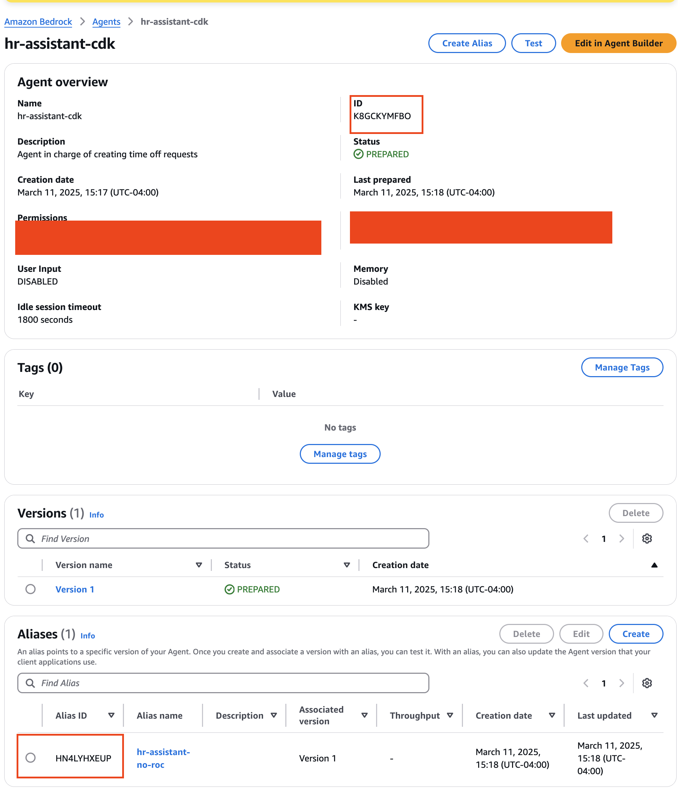
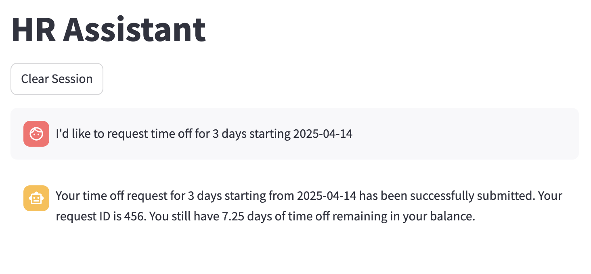
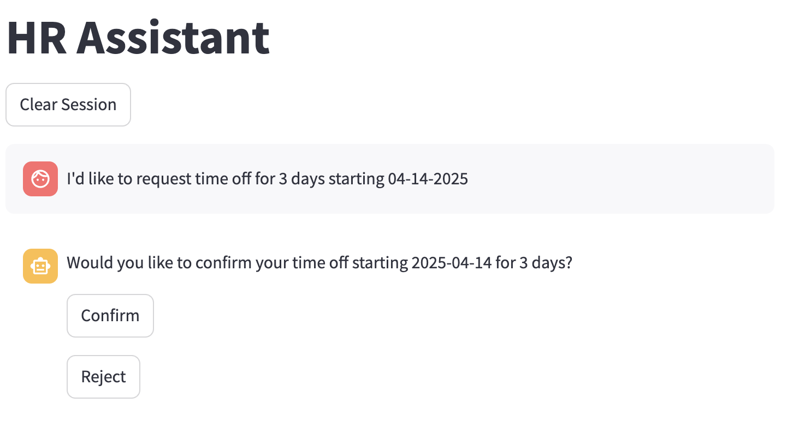
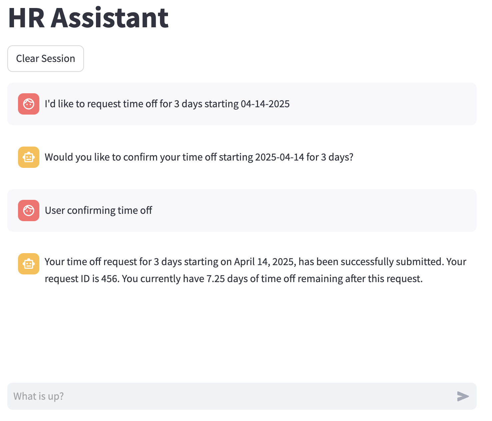
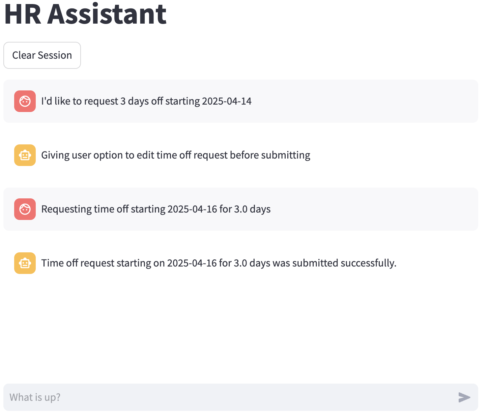

# frontend

## Purpose
This repo provides a UI for showcasing the return of control capabilities in Amazon Bedrock.
This allows you to verify input before sending it to your backend for processing.
The frontend is built using [Streamlit](https://streamlit.io/), a powerful Python framework for creating data-driven web applications, to create an interactive chatbot interface that handles user interactions and displays responses from the Bedrock agent.

## Prerequisites
Before running the frontend application, you need to deploy the backend infrastructure:

1. Follow the [deployment instructions](../cdk/README.md) in the CDK documentation to set up your Bedrock agent
2. Note the `AGENT_ID` and `AGENT_ALIAS_ID` from your deployment, as you'll need these for the frontend configuration. See below screenshot.



Once the backend is deployed, you can proceed with setting up the frontend application.

## Running Locally

### Create virtual environment
```
cd amazon-bedrock-agent-samples/examples/agents/human_in_the_loop/frontend

python3 -m venv .venv

source .venv/bin/activate

pip3 install -r requirements.txt
```

### Create a local .env file
```
cp .env.example .env
```
Replace the values of `AGENT_ID` and `AGENT_ALIAS_ID` to be the values of your deployed Agent in Bedrock.

### Run the app
To run the app, first make sure your region is set to `us-west-2` and then you can set the port of your choice.
```
export AWS_DEFAULT_REGION=us-west-2

streamlit run app.py --server.port=8080
```

By default, the application provides a simple chat interface where users can interact with the HR assistant:



This base implementation can be used for other agent-based applications without modification in some cases.

## Next Steps

To enable return of control (ROC) and confirmation capabilities:

1. Follow the [CDK instructions](../cdk/README.md#updating-agent-to-use-human-in-the-loop-capabilities) to alter the agent to use confirmation or return of control.
2. Update your agent's configuration and publish a new alias
3. Update the `.env` file with the new agent alias ID
4. Re-run the frontend application.

### Frontend with Confirmation
Once confirmation is enabled, the workflow should look like this:





### Frontend with Return-of-Control
Once return of control is enabled, the workflow should look like this:


