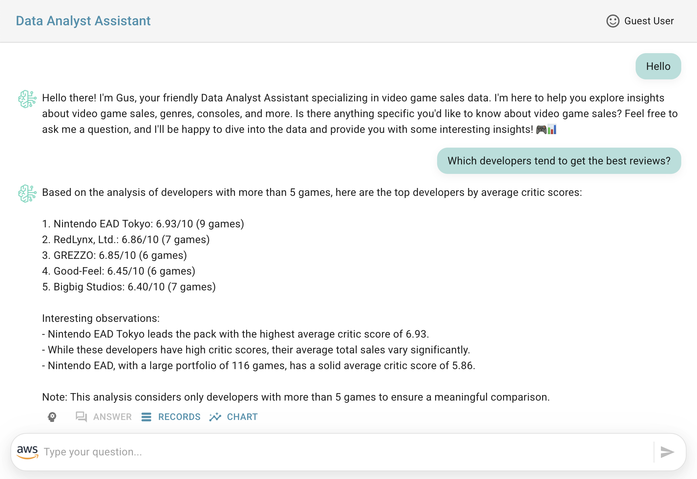
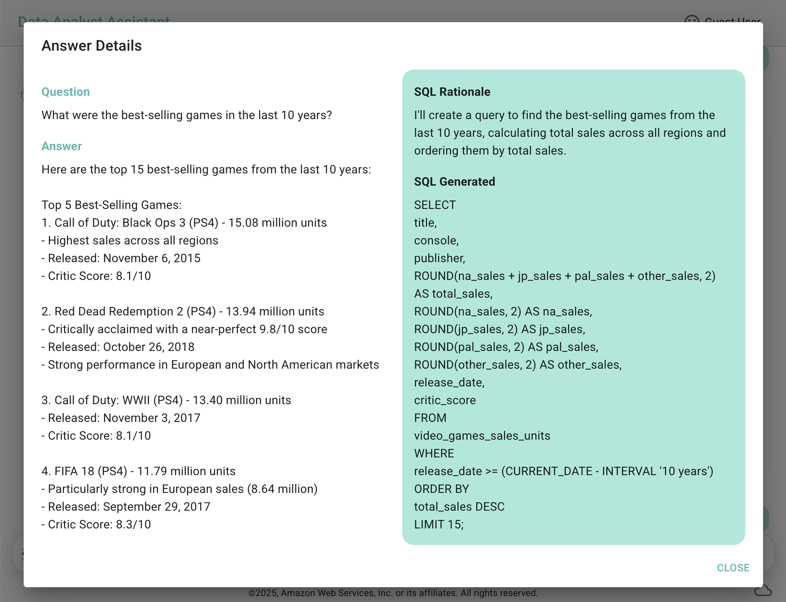
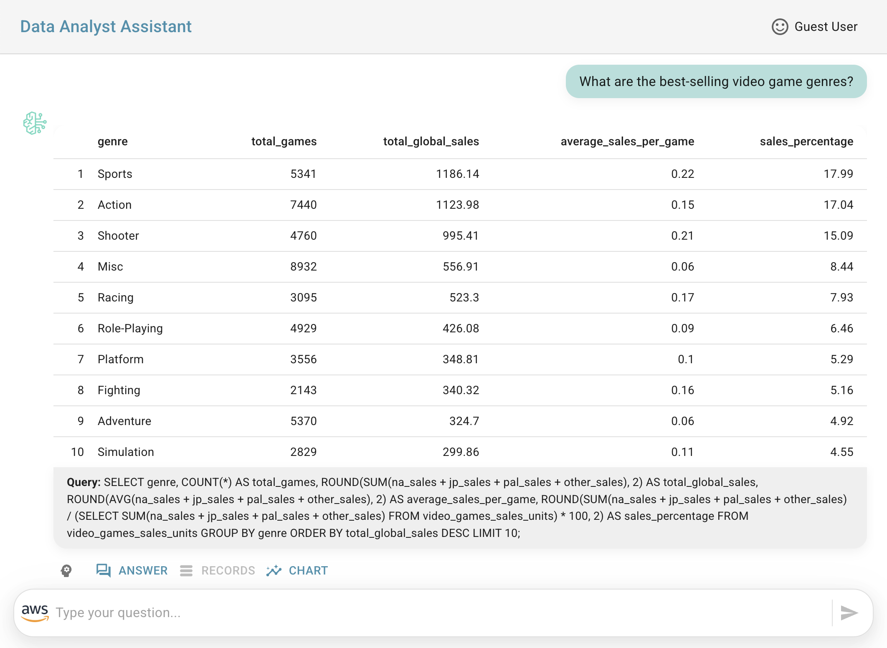
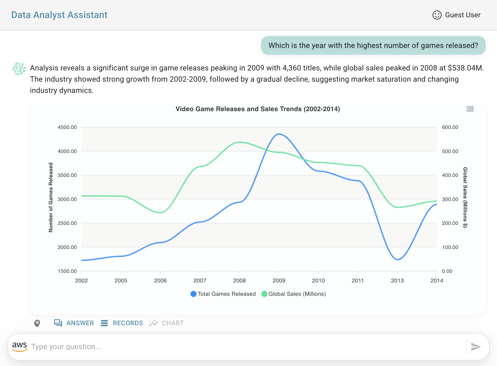
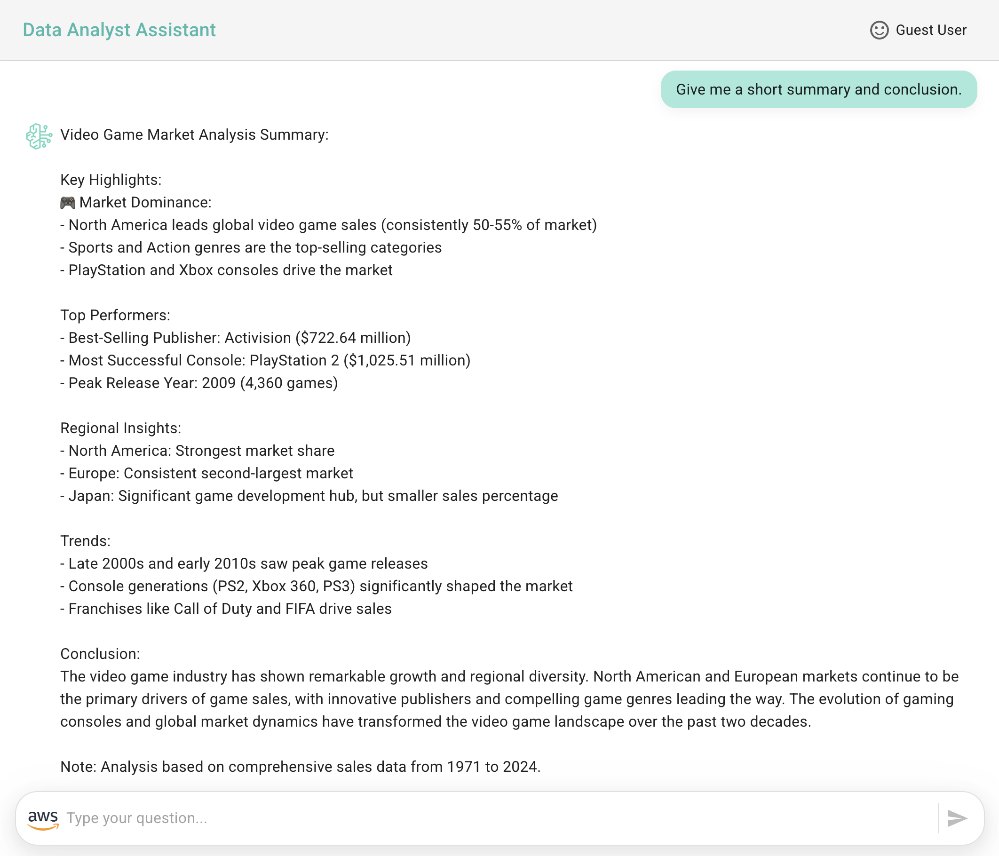

# Getting Started with Amplify Video Games Sales Assistant

This tutorial guides you through the process of setting up a React front-end application using AWS Amplify that integrates with an Amazon Bedrock Agent project. The services to be deployed are: Amplify Hosting, and it leverages Amazon IAM user credentials service authorization from the front-end application.

By the end of this tutorial, you'll have a fully functional Generative AI web application that allows a guest user to interact with a Data Analyst Assistant for Video Game Sales using Amazon Bedrock Agents.

> [!IMPORTANT]
> This sample application is meant for demo purposes and is not production ready. Please make sure to validate the code with your organizations security best practices.
>
> Clean up resources after you test the demo to avoid unnecessary costs. Follow the clean-up steps provided.

## Prerequisites

- An **Alias** created from your **Amazon Bedrock Agent** that you created in the first tutorial.
- [Node.js > 18 version required](https://nodejs.org/en/download/package-manager)
- React Scripts installed by executing the following command:
``` bash
npm install react-scripts
```

**Before proceeding further, verify that you have successfully installed and configured all the listed prerequisites in your development environment.**

## Prepare your Front-End Application

Set up dependencies, configure permissions, and prepare environment variables for your React application to interact with Amazon Bedrock and Amazon DynamoDB.

### Install React Application Dependencies

Command to install required npm packages for React.

``` bash
npm install
```

### Create an IAM User Access Keys for your Front-End Application Permissions

**[Create an IAM user](https://docs.aws.amazon.com/IAM/latest/UserGuide/id_users_create.html) and [create Access key and Secret access key](https://docs.aws.amazon.com/keyspaces/latest/devguide/create.keypair.html) for programmatic access to your front-end application**, you will use these credentials in **env.js** file.

In the **Permissions policies** section of you user, click **Add permissions** and then click **Create inline policy** to add the following inline policy using the **JSON Policy editor**, update the values with your **<agent_arn>**, **<agent_id>**, **<account_id>** and **<question_answers_table_arn>** that you can find in the outputs from the SAM tutorial.

``` json
{
    "Version": "2012-10-17",
    "Statement": [
        {
            "Sid": "InvokeBedrockAgent",
            "Effect": "Allow",
            "Action": [
                "bedrock:InvokeAgent"
            ],
            "Resource": [
                "<agent_arn>",
                "arn:aws:bedrock:*:<account_id>:agent-alias/<agent_id>/*"
            ]
        },
        {
            "Sid": "InvokeBedrockModel",
            "Effect": "Allow",
            "Action": [
                "bedrock:InvokeModel"
            ],
            "Resource": [
                "arn:aws:bedrock:*:<account_id>:inference-profile/us.anthropic.claude-3-5-sonnet-20241022-v2:0",
                "arn:aws:bedrock:us-east-2::foundation-model/anthropic.claude-3-5-sonnet-20241022-v2:0",
                "arn:aws:bedrock:us-east-1::foundation-model/anthropic.claude-3-5-sonnet-20241022-v2:0",
                "arn:aws:bedrock:us-west-2::foundation-model/anthropic.claude-3-5-sonnet-20241022-v2:0"
            ]
        },
        {
            "Sid": "DynamoDB",
            "Effect": "Allow",
            "Action": [
                "dynamodb:Query"
            ],
            "Resource": "<question_answers_table_arn>"
        }
    ]
}
```

### Configure the Environment Variables for the Front-End Application

Rename the file **src/sample.env.js** to **src/env.js** and update the values of the following variables.

AWS credentials of the IAM user that you created previously and the AWS Region that you are using for the deployment:
- **ACCESS_KEY_ID**
- **SECRET_ACCESS_KEY**
- **AWS_REGION**

Update these values that you can find in the CloudFormation Outputs from the SAM project **sam-bedrock-video-games-sales-assistant** for the following variables:
- **AGENT_ID**
- **AGENT_ALIAS_ID**
- **QUESTION_ANSWERS_TABLE_NAME** 

Also, you can update the general application description:

- **APP_NAME**
- **APP_SUBJECT**
- **WELCOME_MESSAGE**


### Testing your Data Analyst Assistant

Now you can test your front-end application locally. Execute the following command:

``` bash
npm start
```

You can use the following sample questions to test the Data Analyst Assistant:

- Hello
- How can you help me?
- What is the structure of the data?
- Which developers tend to get the best reviews?
- What were the total sales for each region between 2000 and 2010? Give me the data in percentages.
- What were the best-selling games in the last 10 years?
- What are the best-selling video game genres?
- Give me the top 3 game publishers.
- Give me the top 3 video games with the best reviews and the best sales.
- Which is the year with the highest number of games released?
- Which are the most popular consoles and why?
- Give me a short summary and conclusion.

## Using Amplify for Hosting your Front-End Application

Execute the following commands for hosting the React front-end application in Amplify.

[Install the Amplify CLI](https://docs.amplify.aws/gen1/react/tools/cli/start/set-up-cli/) with the following command:

``` bash
npm install -g @aws-amplify/cli
```

### Initialize the Amplify Application using **Gen1**

Set up the Amplify project by executing the following command:

``` bash
amplify init
```

- To initialize the project use the **suggested configuration**.
- Select your authentication method.

### Add Hosting and Testing

Execute the following commands to add hosting to your Amplify project:


``` bash
amplify add hosting
```

Use the following configuration:
- Select the plugin module to execute · **Hosting with Amplify Console (Managed hosting with custom domains, Continuous deployment)**
- Choose a type **Manual deployment**

``` bash
amplify publish
```

After the publishing finishes, you can copy the provided **URL** to access your front-end application.

## Front-End Application Preview Images

Congratulations, now you have your Data Analyst Assistant where you can interact and have the following:

- **Conversational interface with agent responding to user's questions.**



- **Answer details including the rationale for generating the SQL query.**



- **Raw query results displayed in tabular format from the SQL query.**



- **Time-series chart visualization generated based on the provided data (charts created using [Apexcharts](https://apexcharts.com/))**.



- **Summary and conclusion derived from the data analysis conversation.**




## Cleaning-up Resources (optional)

The next step is optional to delete the resources that we've created.

``` bash
amplify delete
```

Do not forget to [remove your IAM User](https://docs.aws.amazon.com/IAM/latest/UserGuide/id_users_remove.html) and Access keys for your front-end application.

## Thank You

## License

This project is licensed under the Apache-2.0 License.