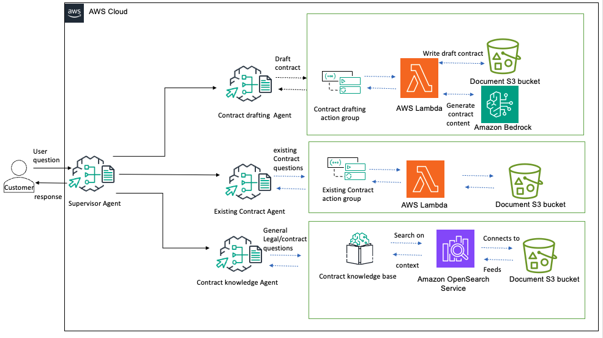

# Contract Assistant Agent

This example demonstrates the use of Amazon Bedrock Agents multi-agent collaboration with its built-in Routing Classifier feature. By simply enabling that mode for your supervisor, Bedrock automatically routes to the correct collaborating sub-agent using LLM intent classification optimized to route with sub-second latency. Contrast that with a traditional supervisor that must go through its own orchestration loop, a more expensive proposition that can take 3-6 seconds depending on which LLM you are using. This feature is most valuable when trying to build a unified customer experience across a set of sub-agents. In our example, we have 3 collaborators: one for general Contract questions, one for handling conversations about Existing Contracts, and another for dealing with New Contracts.




Try sample prompts:


- "I need help with a purchase agreement."
- "Can you show me the status of contract #12345?"

Each of these gets routed quickly to the right sub-agent for subsequent processing.
Conversation switching is seamless.

Routing also reverts automatically to full Supervisor mode if the request is truly
not mapping cleanly to a single collaborator. 

> [!CAUTION]  
> The sample contract templates are not legal advice, are for illustrative purposes only, and should not be relied upon without consulting the user's own attorney.

## Prerequisites

1. Clone and install repository

```bash
git clone https://github.com/awslabs/amazon-bedrock-agent-samples

cd amazon-bedrock-agent-samples

python3 -m venv .venv

source .venv/bin/activate

pip3 install -r src/requirements.txt
```

## Usage & Sample Prompts

1. Deploy Amazon Bedrock Agents

```bash
cd examples/multi-agent-collaboration/contract_assistant_agent/
python3 main.py --recreate_agents "true"
```

2. Invoke

```bash
python3 main.py --recreate_agents "false"
```

3. Cleanup

```bash
python3 main.py --clean_up "true"
```

## License

This project is licensed under the Apache-2.0 License.

The sample contract template is licensed under CC-0.