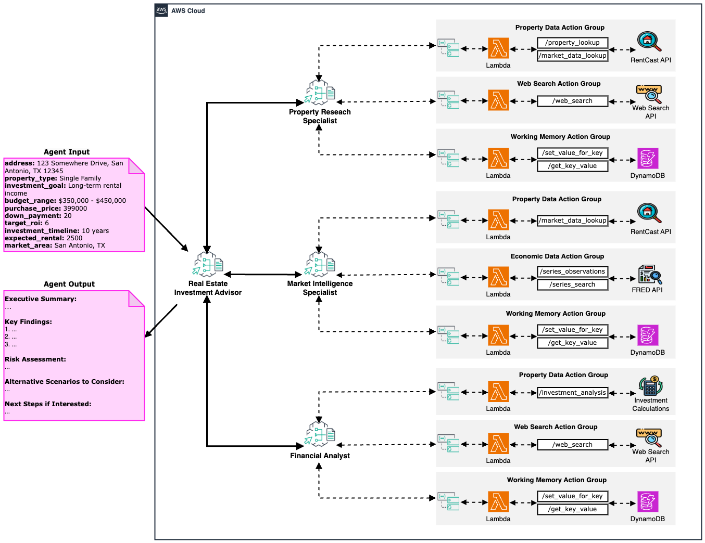

# Real Estate Investment Agent

The Real Estate Investment Agent provides comprehensive property investment analysis by leveraging multiple specialized agents working together. It combines detailed property research, economic data analysis, and financial modeling to deliver data-driven investment recommendations.



## Overview
    
This example demonstrates how to create a sophisticated multi-agent system that can analyze investment opportunities by:

1. Researching specific properties and their characteristics
2. Gathering economic indicators relevant to real estate markets
3. Creating detailed financial projections based on actual data
4. Synthesizing all information into actionable investment advice

The agent uses three specialized collaborators managed by a supervisor agent, with each collaborator having access to specific tools for their area of expertise.

## Prerequisites

1. Deploy the required tool dependencies:
   - [Property Data Tool](/src/shared/property_data/) - for property information from RentCast
   - [Economic Data Tool](/src/shared/economic_data/) - for economic indicators from FRED
   - [Web Search Tool](/src/shared/web_search/) - for additional online research
   - [Working Memory Tool](/src/shared/working_memory/) - for state management between agents


2. Clone and install repository

```bash
git clone https://github.com/awslabs/amazon-bedrock-agent-samples

cd amazon-bedrock-agent-samples

python3 -m venv .venv

source .venv/bin/activate

pip3 install -r src/requirements.txt
```

## Usage

1. Deploy Amazon Bedrock Agents

```bash
python3 examples/multi_agent_collaboration/real_estate_investment_agent/main.py --recreate_agents "true"
```

2. Invoke the agent with default parameters

```bash
python3 examples/multi_agent_collaboration/real_estate_investment_agent/main.py --recreate_agents "false"
```

You can customize these parameters:
- `--address`: Address of the property to analyze
- `--property_type`: Type of property (Single Family, Condo, etc.)
- `--investment_goal`: Investment goals (cash flow, appreciation, etc.)
- `--budget_range`: Budget range for the investment
- `--purchase_price`: Purchase price of the property
- `--down_payment`: Down payment percentage
- `--target_roi`: Target return on investment percentage
- `--investment_timeline`: Investment timeline (years)
- `--expected_rental`: Expected monthly rental income
- `--market_area`: Market area for analysis

3. Cleanup

```bash
python3 examples/multi_agent_collaboration/real_estate_investment_agent/main.py --clean_up "true"
```

## Agent Architecture

### Supervisor Agent
- **Investment Advisor**: Coordinates the specialized agents and synthesizes their findings into a comprehensive investment recommendation

### Collaborator Agents
1. **Property Research Specialist**:
   - Researches detailed property information
   - Uses property data tools to get specifications, valuation, and rent estimates
   - Analyses neighborhood characteristics and trends

2. **Market Intelligence Specialist**:
   - Analyses broader market conditions and economic factors
   - Uses economic data tools to retrieve mortgage rates, price indices, vacancy rates, CPI, and unemployment rates
   - Identifies market trends and risk factors

3. **Financial Analyst**:
   - Creates financial models and ROI projections
   - Incorporates property data and economic indicators into calculations
   - Evaluates different financing scenarios and investment outcomes

## Key Features

- **Data-Driven Analysis**: Uses actual property data and economic indicators rather than estimates
- **Multi-Source Integration**: Combines RentCast property data with FRED economic indicators
- **Structured Workflow**: Sequential task processing with state management via working memory
- **Comprehensive Reporting**: Provides detailed investment analysis with supporting data

## Example Prompt Templates

### Property Research
```
Analyse the investment potential of [ADDRESS]. 
I'm considering buying this property for [PURCHASE_PRICE] with a [DOWN_PAYMENT]% down payment.
I'm targeting a [TARGET_ROI]% ROI over [INVESTMENT_TIMELINE].
I expect I could rent it for around [EXPECTED_RENTAL]/month.
```

### Market Analysis
```
What economic factors should I consider when investing in real estate in [MARKET_AREA]?
How are mortgage rates, home prices, and rental vacancy rates trending?
```

### Financial Analysis
```
Create a financial analysis for a [PROPERTY_TYPE] in [MARKET_AREA] with:
- Purchase price: [PURCHASE_PRICE]
- Down payment: [DOWN_PAYMENT]%
- Expected rental income: [EXPECTED_RENTAL]/month
- Investment timeline: [INVESTMENT_TIMELINE]
```

## How it Works

1. The supervisor agent (Investment Advisor) receives a property investment analysis request
2. It assigns tasks to each specialized agent in sequence:
   - Property Researcher analyzes the specific property
   - Market Intelligence gathers relevant economic indicators
   - Financial Analyst creates projections using all available data
3. Each agent saves its findings to working memory for other agents to access
4. The Investment Advisor synthesizes all information into a final recommendation

This sequential workflow ensures that each specialist has access to the data it needs, with economic indicators informing financial projections and property-specific details providing accurate inputs for calculations.

## License

This project is licensed under the Apache-2.0 License.
